Các bước để làm bài

I. Setup

1. Tạo một repository tên là NetExercise trên github rồi clone về máy
2. Tạo một empty solution có tên là NetExercise sao cho file NetExercise.sln nằm trong thư mục gốc
3. Thêm vào solution một project có kiểu là Library, ngôn ngữ C#, sử dụng DotnetCore tên là NetExercise

Thao tác 2, 3 có thể gộp lại nhưng chú ý project phải đúng yêu cầu như trên

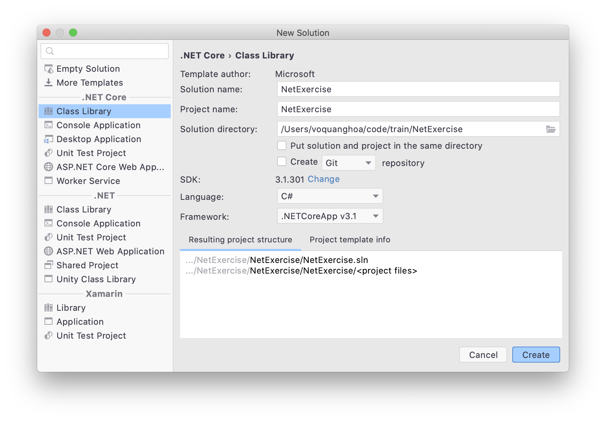

4. Tạo Test Project có tên là NetExercise.Test, ngôn ngữ C# và Type là NUnit

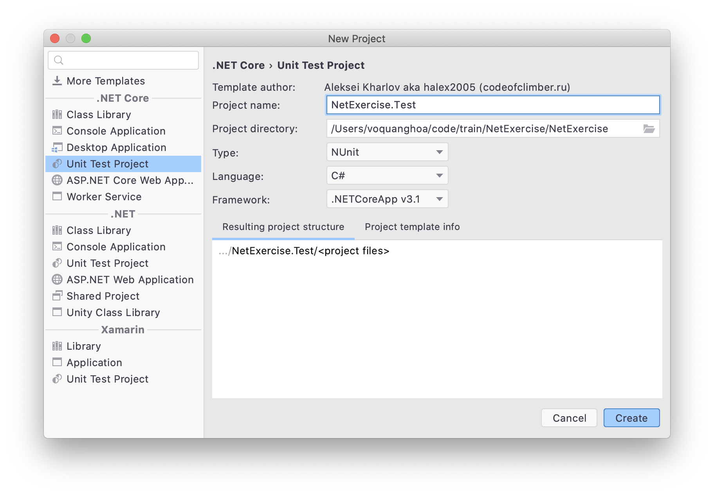

5. Tạo liên kết từ Project NetExercise đến project NetExercise.Test bằng cách từ project NetExercise.Test chọn Add References

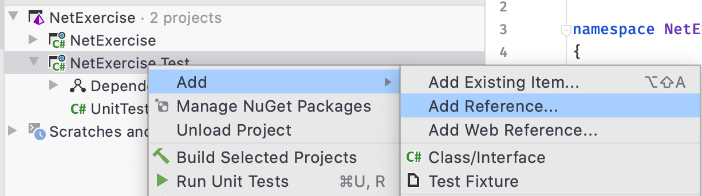

Sau đó chọn dự án NetExercise và Add

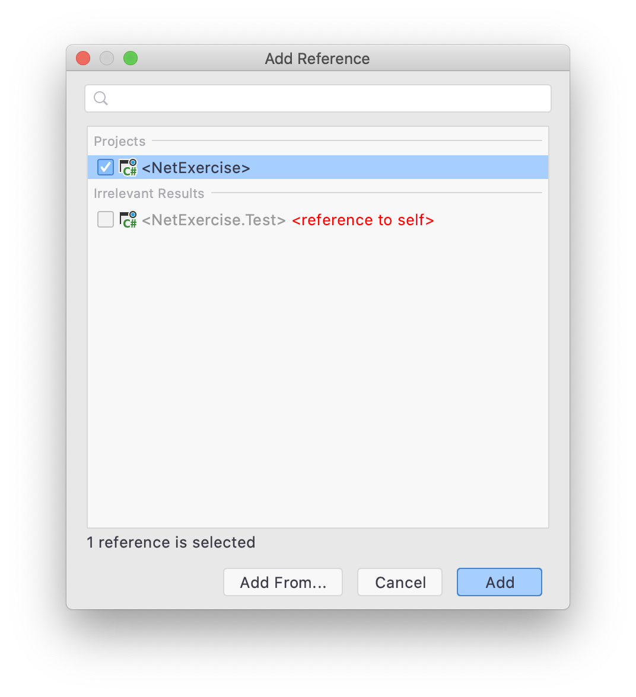

6. Xóa class mặc định

Trong 2 projects đã tạo, ta thấy 2 class mặc định là Class1.cs và UnitTest1.cs, xóa cả 2 đi.

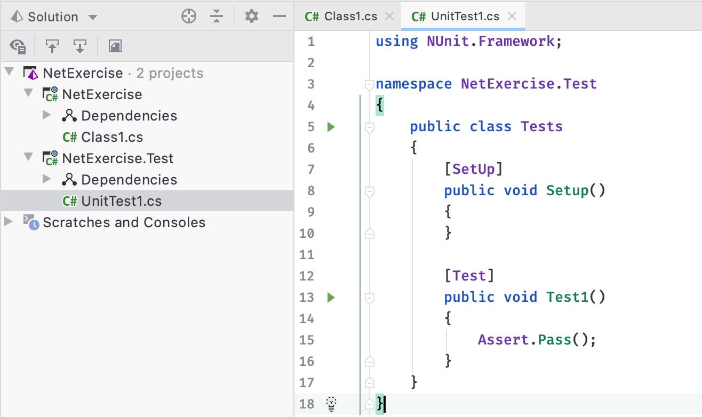

7. Build cả 2 project

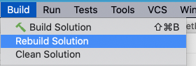

8. Thêm file này [.gitignore](.gitignore) vào thư mục gốc

9. Push code lên repository

II. Implement bài mới

1. Đảm bảo mình đang ở nhánh master mới nhất

```
git checkout master
git pull
```

2. Nếu bắt đầu làm một phần mới, hãy tạo thư mục tương ứng để lưu trữ code, ví dụ ở đây là Basic

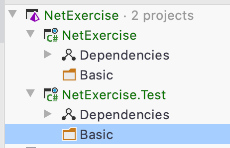

3. Tạo file class với mã nguồn tương ứng để giải

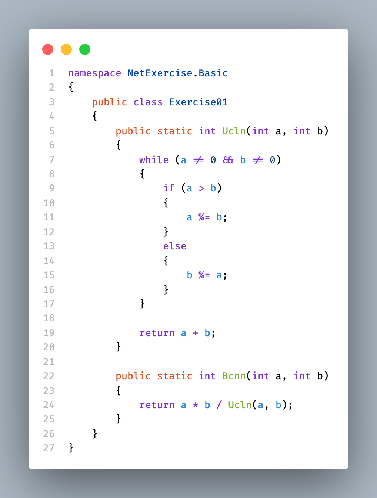

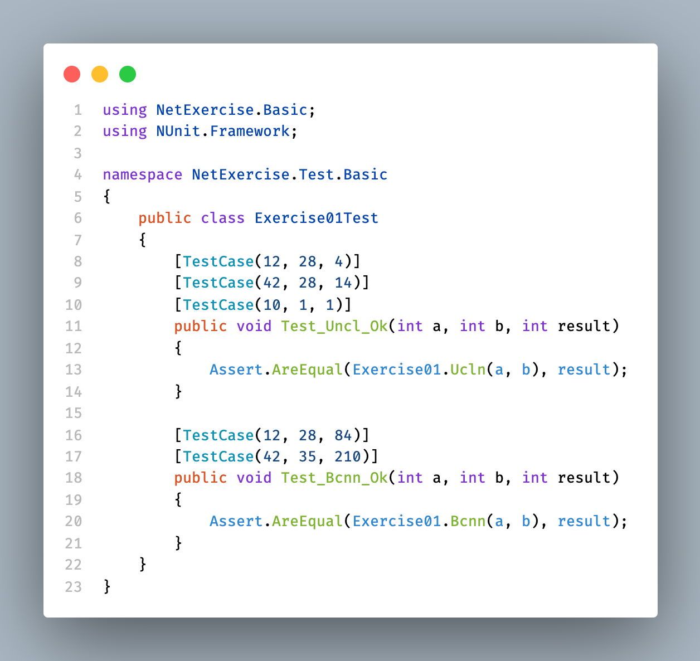

4. Chạy UnitTest bằng cách right click lên class test (Ở đây là Exercise01Test) và chọn Run Unit Test
   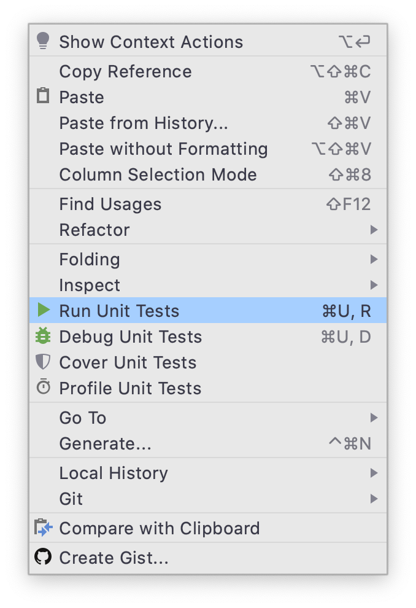

5. Đảm bảo tất cả các test case đều pass

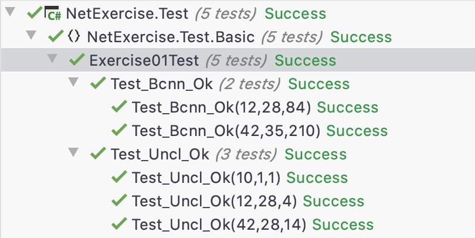
